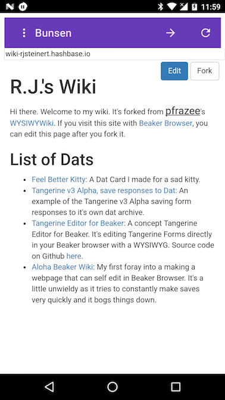

# Bunsen


Bunsen is a front-end for [dat](https://datproject.org/) using Apache Cordova to render an Angular 4 app that performs dat functions for sharing and consuming network resources. This project current creates Android APK's, but could support iOS someday.

[](docs/images/bunsen_browser_wiki_large.png)

## How to use Bunsen

Bunsen is currently very alpha-quality software. It runs only on mobile devices runnning ARM64 processors such as Nexus 5X and Pixel.

To install Bunsen, start by going to your Android Device's Settings App. Then open "Security" and then enable "Unknown Sources". Then download [this link](https://github.com/bunsenbrowser/bunsen/blob/master/apk/bunsen.apk) to your Android device, open it from the menu tray, and then give it permission to install.

When Bunsen starts, it will display a loading dialog for about ten seconds while the node express server launches.

Bunsen will load and display a single dat when you enter the dat address (without dat://) and press the forward button.
It comes with a dat address pre-loaded, so give it a try!

To load another dat, use the option menu to delete the current dat, then  enter the dat address (without dat://) and press the forward button.

In the background, Bunsen will share the dat you have loaded.

For more information, there is a [walkthrough](https://github.com/bunsenbrowser/bunsen/wiki/Bunsen-Walkthrough) with screenshots.


## What is dat?
You could say that dat is a distributed data sharing tool that uses p2p peers like bittorrent, except it's live, so you can update the content easily. Kudos to aldebrn and mafintosh for that description.


## Development

### Develop on your local machine
Requirements:
- Node.js and npm
  - On Mac and Windows, go to http://nodejs.org and download the LATEST installer version listed on the homepage of http://nodejs.org

```
git clone git@github.com:bunsenbrowser/bunsen
cd bunsen
npm install
```

You will need to start two services, the UI and the Server in two different terminals.

In the first terminal:
```
cd bunsen-ang/src/node
node server.js
```

In the second terminal:
```
cd bunsen-ang
npm start
```

### Test on Device
Requirements:
- Node.js and npm
  - On Mac and Windows, go to http://nodejs.org and download the LATEST installer version listed on the homepage of http://nodejs.org
- `adb` which is included as a binary in android-platform-tools.
  - On Mac, easiest way to install is using brew package manager `brew cask install android-platform-tools`
  - On Ubuntu, easiest way is `sudo apt install android-tools-adb android-tools-fastboot`
- Enable USB debugging on your Android device. https://www.howtogeek.com/129728/how-to-access-the-developer-options-menu-and-enable-usb-debugging-on-android-4.2/

Run the following to build and install on an Android device.
```
npm install -g cordova
git clone git@github.com:bunsenbrowser/bunsen
cd bunsen
npm install
./install.sh
```

## Architecture
Bunsen consists of a UI App that is the chrome of the browser and an iframe that points at a Dat Server to display the requested Dat. When a user enters a Dat into the bar, it contacts the Dat Server by sending a GET request to `https://localhost:8080/dat/<dat UUID>`, waits until it is ready, and then displays an iframe that points to `https://localhost:8080/` where the backend Dat server that is serving the downloaded Dat.

The location of the UI is at `./bunsen-ang/` while the location of the Dat Server is at `./bunsen-ang/assets/node/`.

The Cordova application depends on the [cordova-node-plugin](https://github.com/bunsenbrowser/cordova-node-plugin)
to provide the node instance. If you wish to modify that plugin, fork/clone it and link to it:

`cordova plugin add --link ../cordova-plugin-node`

Run the `prep-plugin.sh` script whenever you make changes to the plugin; it removes and re-installs the plugin.

The node_modules packages have been compiled in termux on a Nexus 5X.

## Why do we need Bunsen Browser?

### Websites that scale with the demand
When you view a Dat site, you help host it. This democratizes the Internet so as demand increases, so does your hosting. You do not need expensive hosting or advertising to support your voice.

### Millions of people use the "offline web" but cannot trust its content, Bunsen and Dat solve this
Millions of people living under repressive regimes are blocked from the Internet and depend on outside access to digital content by way of smuggled USB Flash Drives. There are 6 billion people offline who have are offline and not able to verify content they receive while offline causing issues around misinformation, land rights, forged medical data, and many others.

Bunsen uses Dat to shine a light on the offline web by solving two problems.

1. How to easily update and merge content between two devices while offline.
2. How to verify content came from the source it claims to come from.

To understand how that works, a quick analogy about cryptographic keys.

In "Cryptoland", anyone can generate two unique magic key pairs. One key can lock anything it touches, another unlocks anything it touches. These are referred to as "private" and "public" keys. If you want someone to verify a package you send them, you give them a copy of the public key that unlocks things. Before you send your package you lock it with your private key. Now when people receive a package from you, they unlock it with the public key you gave them and they know it definitely came from you because you are the only person in the world that could have locked that package.

This is one feature of SSL/HTTPS in browsers online. When you go to https://nytimes.com, your browser uses NY Times public key to verify that the web page came from the New York Times and was not intercepted and modified somewhere along the way by some misguided government or criminal.

But there's no SSL in the offline world. We distribute applications and files over USB drives and when a person opens them up, they have no user-friendly way of verifying that content came from who they hope it came from. Bunsen makes this user friendly because it can sync and open Dat archives.

When you are online, you access Dat archives online using their dat address (dat://....). The same address is the public key. That Dat public key is then used to verify that all of the contents are locked by the person with the magic locking key, similar to SSL/HTTPS. Unlike most websites, a user can chose to save that website into their Bunsen Browser for use offline. When they are offline, using their Bunsen browsers they can send that same Dat archive to other devices running Bunsen. This allows offline verification that content came from where it claims to have come from.

To illustrate this point, here's an example:

> Jane and Sally are online separately at some point and download a Dat archive of the New York Times website. Then Sally goes out into the field where there is not Internet access. Meanwhile Jane is home the next day in the city where there is Internet access and her Bunsen browser gets the day's updates of the NY Times Dat Archive. Now Jane goes out into the field to join Sally where there is no Internet. Their Bunsen browsers connect to each other wirelessly without Internet and Sally's Bunsen browser sees there is an update of the NY Times Dat Archive on Jane's device. Sally's Bunsen browser transfers the update and Bunsen Browser using Dat automatically verifies all updates came from the NY Times using the public key.
In order to get verified content, they spend less money going online as the same content does not need to be downloaded from the Internet on every device, it's easily synced and verified using Bunsen.

In that example, perhaps Jane and Sally don't even know each other. They can still trust that when they receive updates for their Dat archives, it came from the actual source.

## Credit
- Chris Kelley https://github.com/chrisekelley
- R.J. Steinert https://github.com/rjsteinert
- Thanks to Ben Davis for providing the original Bunsen image for the logo. https://thenounproject.com/search/?q=bunsen&i=490710
- Kudos to https://www.becompany.ch/en/blog/2016/10/19/creating-apache-cordova-app-with-angular2 for the primer on running an Angular app inside Cordova.
- Many thanks to @mafintosh for leading the way with [node-on-android](https://github.com/node-on-mobile/node-on-android). This project depends on the node shared library his project provides.
- And thank you to all the wonderful people who have worked so hard to make Dat (https://datproject.org/) and Beaker Browser (beakerbrowser.com) what is today!
